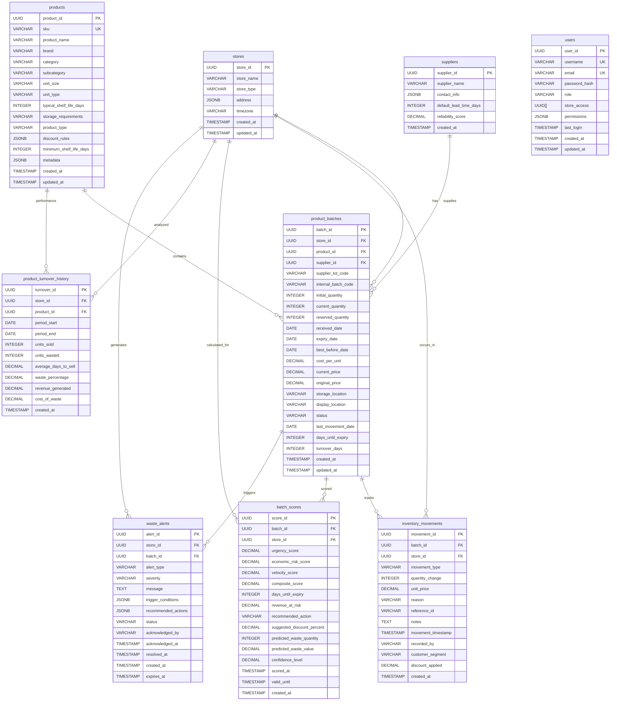

# LIFO Databse ERD

```mermaid
erDiagram
    stores {
        UUID store_id PK
        VARCHAR store_name
        VARCHAR store_type
        JSONB address
        VARCHAR timezone
        TIMESTAMP created_at
        TIMESTAMP updated_at
    }
    
    products {
        UUID product_id PK
        VARCHAR sku UK
        VARCHAR product_name
        VARCHAR brand
        VARCHAR category
        VARCHAR subcategory
        VARCHAR unit_size
        VARCHAR unit_type
        INTEGER typical_shelf_life_days
        VARCHAR storage_requirements
        VARCHAR product_type
        JSONB discount_rules
        INTEGER minimum_shelf_life_days
        JSONB metadata
        TIMESTAMP created_at
        TIMESTAMP updated_at
    }
    
    suppliers {
        UUID supplier_id PK
        VARCHAR supplier_name
        JSONB contact_info
        INTEGER default_lead_time_days
        DECIMAL reliability_score
        TIMESTAMP created_at
    }
    
    product_batches {
        UUID batch_id PK
        UUID store_id FK
        UUID product_id FK
        UUID supplier_id FK
        VARCHAR supplier_lot_code
        VARCHAR internal_batch_code
        INTEGER initial_quantity
        INTEGER current_quantity
        INTEGER reserved_quantity
        DATE received_date
        DATE expiry_date
        DATE best_before_date
        DECIMAL cost_per_unit
        DECIMAL current_price
        DECIMAL original_price
        VARCHAR storage_location
        VARCHAR display_location
        VARCHAR status
        DATE last_movement_date
        INTEGER days_until_expiry
        INTEGER turnover_days
        TIMESTAMP created_at
        TIMESTAMP updated_at
    }
    
    inventory_movements {
        UUID movement_id PK
        UUID batch_id FK
        UUID store_id FK
        VARCHAR movement_type
        INTEGER quantity_change
        DECIMAL unit_price
        VARCHAR reason
        VARCHAR reference_id
        TEXT notes
        TIMESTAMP movement_timestamp
        VARCHAR recorded_by
        VARCHAR customer_segment
        DECIMAL discount_applied
        TIMESTAMP created_at
    }
    
    batch_scores {
        UUID score_id PK
        UUID batch_id FK
        UUID store_id FK
        DECIMAL urgency_score
        DECIMAL economic_risk_score
        DECIMAL velocity_score
        DECIMAL composite_score
        INTEGER days_until_expiry
        DECIMAL revenue_at_risk
        VARCHAR recommended_action
        DECIMAL suggested_discount_percent
        INTEGER predicted_waste_quantity
        DECIMAL predicted_waste_value
        DECIMAL confidence_level
        TIMESTAMP scored_at
        TIMESTAMP valid_until
        TIMESTAMP created_at
    }
    
    product_turnover_history {
        UUID turnover_id PK
        UUID store_id FK
        UUID product_id FK
        DATE period_start
        DATE period_end
        INTEGER units_sold
        INTEGER units_wasted
        DECIMAL average_days_to_sell
        DECIMAL waste_percentage
        DECIMAL revenue_generated
        DECIMAL cost_of_waste
        TIMESTAMP created_at
    }
    
    waste_alerts {
        UUID alert_id PK
        UUID store_id FK
        UUID batch_id FK
        VARCHAR alert_type
        VARCHAR severity
        TEXT message
        JSONB trigger_conditions
        JSONB recommended_actions
        VARCHAR status
        VARCHAR acknowledged_by
        TIMESTAMP acknowledged_at
        TIMESTAMP resolved_at
        TIMESTAMP created_at
        TIMESTAMP expires_at
    }
    
    users {
        UUID user_id PK
        VARCHAR username UK
        VARCHAR email UK
        VARCHAR password_hash
        VARCHAR role
        UUID[] store_access
        JSONB permissions
        TIMESTAMP last_login
        TIMESTAMP created_at
        TIMESTAMP updated_at
    }
    
    %% Relationships
    stores ||--o{ product_batches : "has"
    products ||--o{ product_batches : "contains"
    suppliers ||--o{ product_batches : "supplies"
    
    product_batches ||--o{ inventory_movements : "tracks"
    stores ||--o{ inventory_movements : "occurs_in"
    
    product_batches ||--o{ batch_scores : "scored"
    stores ||--o{ batch_scores : "calculated_for"
    
    stores ||--o{ product_turnover_history : "analyzed"
    products ||--o{ product_turnover_history : "performance"
    
    stores ||--o{ waste_alerts : "generates"
    product_batches ||--o{ waste_alerts : "triggers"
```
